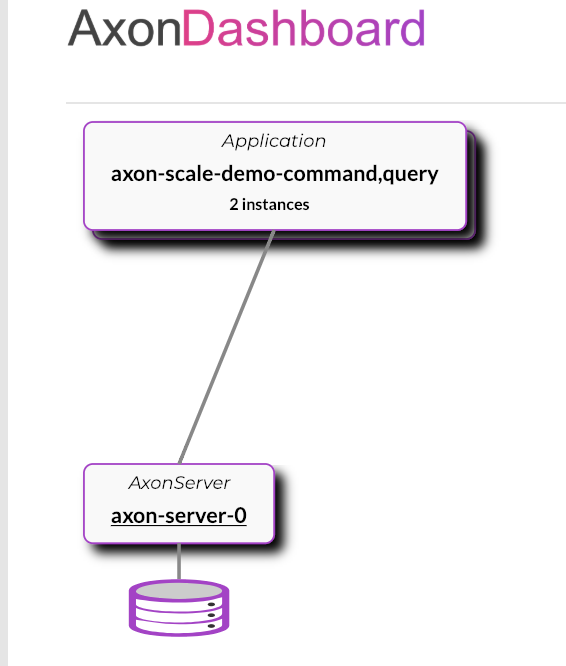
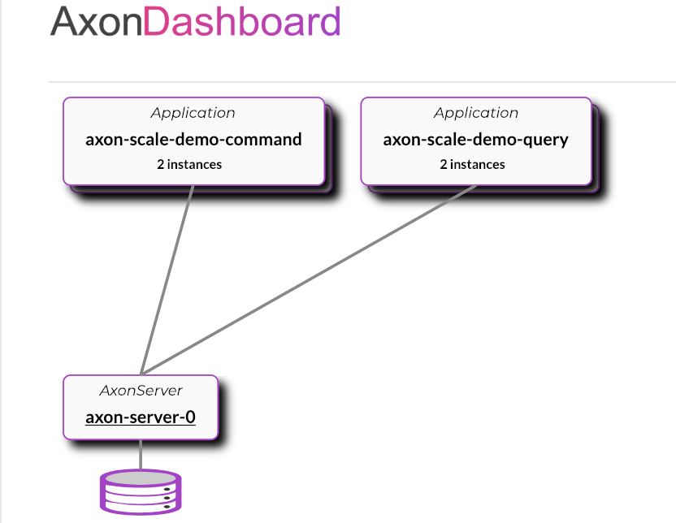
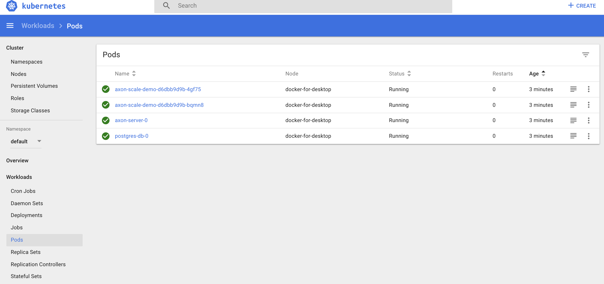

# axon-scale-demo

This [Axon](https://axoniq.io/) **demo project** demonstrates two different deployment strategies:
 - monolithic (both Spring profiles `command` and `query` are activated within one application/service, the final result is one application/service running: `axon-scale-demo`)
 - microservices (only one Spring profile is activated per application/service, the final result are two applications/services running: `axon-scale-demo-command` and `axon-scale-demo-command`)

with two different versions:
 - [non-cluster version](#non-cluster-version) (on local host) and/or 
 - [cluster version](#cluster-version-kubernetes) (to local Kubernetes cluster)
 

## Non-Cluster version

This scenario covers running of Spring Boot application/s directly on the host machine. There is no cluster, and only one instance of the application/service is running at the same time.

There are two deployment strategies:
 - [monolithic version](#run-monolithic-version)
 - [microservices version](#run-microservices-version)

### Run Axon Server

You can [download](https://download.axoniq.io/axonserver/AxonServer.zip) a ZIP file with AxonServer as a standalone JAR. This will also give you the AxonServer CLI and information on how to run and configure the server.

### Run monolithic version

`command` and `query` Spring profiles are activated, grouping command and query components into one monolithic application.

You can run the following command to start monolithic version locally:
```
$ ./mvnw spring-boot:run -Dspring.profiles.active=command,query
```

**Verify**:
```
$ curl -i -X POST -H 'Content-Type:application/json' -d '{"value" : "1000"}' 'http://localhost:8080/commandcards'
```
```
$ curl http://localhost:8080/querycards
```

> We use H2 SQL database. Web console is enabled, and it should be available on `/h2-console` URL (eg. `http://localhost:8080/h2-console`). Datasource URL: `jdbc:h2:mem:axon-scale-demo-command,query`

### Run microservices version

`command` and `query` services/applications are separately deployed. Each service activated appropriate Spring profile (`command` or `query`).

You can run the following commands to start microservices version locally:
```
$ ./mvnw spring-boot:run -Dspring.profiles.active=command -Dserver.port=8081
$ ./mvnw spring-boot:run -Dspring.profiles.active=query -Dserver.port=8082

```

> Each application use its own H2 SQL database. 
> H2 Web console of command application is enabled, and it should be available on `/h2-console` URL (eg. `http://localhost:8081/h2-console`). Datasource URL: `jdbc:h2:mem:axon-scale-demo-command`.
> H2 Web console of query application is enabled, and it should be available on `/h2-console` URL (eg. `http://localhost:8082/h2-console`). Datasource URL: `jdbc:h2:mem:axon-scale-demo-query`.

**Verify**:

```
$ curl -i -X POST -H 'Content-Type:application/json' -d '{"value" : "1000"}' 'http://localhost:8081/commandcards'
```
```
$ curl http://localhost:8082/querycards
```


## Cluster version (Kubernetes)

This scenario covers deployment of our containerized (Docker) applications/services to the Kubernetes cluster, so we can scale services better.


There are two deployment strategies:
 - [monolithic version](#deploy-monolithic-version)
 - [microservices version](#deploy-microservices-version)

### Build the Docker image

Build the application image with [Jib](https://github.com/GoogleContainerTools/jib) directly to a Docker daemon. 'Jib' uses the `docker` command line tool and requires that you have docker available on your PATH.

```
$ ./mvnw compile jib:dockerBuild -Dimage=axon-scale-demo
```

> 'Jib' separates your application into multiple layers, splitting dependencies from classes. Now you don’t have to wait for Docker to rebuild your entire Java application - just deploy the layers that changed.

### Deploy Docker stack to Kubernetes

You typically use docker-compose for local development because it can build and works only on a single docker engine. Docker stack and docker service commands require a `Docker Swarm (configured by defaut)` or `Kubernetes cluster`, and they are step towards production.

[Docker Desktop](https://www.docker.com/products/docker-desktop) comes with Kubernetes and the Compose controller built-in, and enabling it is as simple as ticking a box in the settings.

Now, we can use Docker Compose file and native Docker API for [`stacks`](https://docs.docker.com/engine/reference/commandline/stack/) to manage applications/services on local Kubernetes cluster.

#### Deploy monolithic version
`command` and `query` Spring profiles are activated, grouping command and query components into one [monolithic application](docker-compose.monolith.yml).
```
$ docker stack deploy --orchestrator=kubernetes -c docker-compose.monolith.yml axon-sacle-demo-stack
```


**Verify**

```
$ curl -i -X POST -H 'Content-Type:application/json' -d '{"value" : "1000"}' 'http://localhost:8080/commandcards'
```
```
$ curl http://localhost:8080/querycards
```
#### Deploy microservices version
`command` and `query` services/applications are separately deployed. [Each service](docker-compose.microservices.yml) is activating appropriate Spring profile (`command` or `query`).
```
$ docker stack deploy --orchestrator=kubernetes -c docker-compose.microservices.yml axon-sacle-demo-stack
```


**Verify**

```
$ curl -i -X POST -H 'Content-Type:application/json' -d '{"value" : "1000"}' 'http://localhost:8081/commandcards'
```
```
$ curl http://localhost:8082/querycards
```

### Kubernetes Web UI (Dashboard)

Dashboard is a web-based Kubernetes user interface. You can use Dashboard to deploy containerized applications to a Kubernetes cluster, troubleshoot your containerized application, and manage the cluster resources.

The Dashboard UI is not deployed by default. To deploy it, run the following command:
```
$ kubectl create -f https://raw.githubusercontent.com/kubernetes/dashboard/master/aio/deploy/recommended/kubernetes-dashboard.yaml

```
You can access Dashboard by running the following command:
```
$ kubectl proxy
```
Kubectl will make Dashboard available at [http://localhost:8001/api/v1/namespaces/kube-system/services/kubernetes-dashboard/proxy](http://localhost:8001/api/v1/namespaces/kube-system/services/kubernetes-dashboard/proxy)



### Kubernetes persistent volumes

There are several different types of volumes that are handled by Compose for Kubernetes.

The following Compose snippet declares a service that uses a persistent volume:
```yaml
services:
  axon-server:
    image: axoniq/axonserver
    hostname: axon-server
    environment:
      - AXONSERVER_EVENTSTORE=/eventstore
      - AXONSERVER_CONTROLDB=/controldb
    volumes:
      - axonserver-eventstore:/eventstore
      - axonserver-controldb:/controldb
    ports:
      - '8024:8024'
      - '8124:8124'
volumes:
  axonserver-eventstore:
  axonserver-controldb:
```

A [persistentVolumeClaim]((https://kubernetes.io/docs/concepts/storage/persistent-volumes/)) volume is used to mount a PersistentVolume into a Pod. PersistentVolumes are a way for users to “claim” durable storage (such as a GCE PersistentDisk or an iSCSI volume) without knowing the details of the particular cloud environment.

> This demo is focusing on scaling axon (spring boot) application/s itself. Infrastructure components like AxonServer and Postgres are not in the focus.
Nevertheless it is fair to say that the data that this components collect is saved in a durable way via `PersistentVolume`s keeping us closer to Production.


### Remove Docker stack
```
$ docker stack rm --orchestrator=kubernetes axon-sacle-demo-stack
```


## Run tests

This project comes with some rudimentary tests as a good starting
point for writing your own. Use the following command to execute the
tests using Maven:

```
$ ./mvnw test
```

## References and further reading

- [https://docs.axoniq.io/reference-guide](https://docs.axoniq.io/reference-guide/)
- [https://blog.docker.com/2018/12/simplifying-kubernetes-with-docker-compose-and-friends](https://blog.docker.com/2018/12/simplifying-kubernetes-with-docker-compose-and-friends/)
---

[maven]: https://maven.apache.org/ (Maven)
[atomist]: https://www.atomist.com/ (Atomist)
[axon]: https://axoniq.io/ (Axon)
